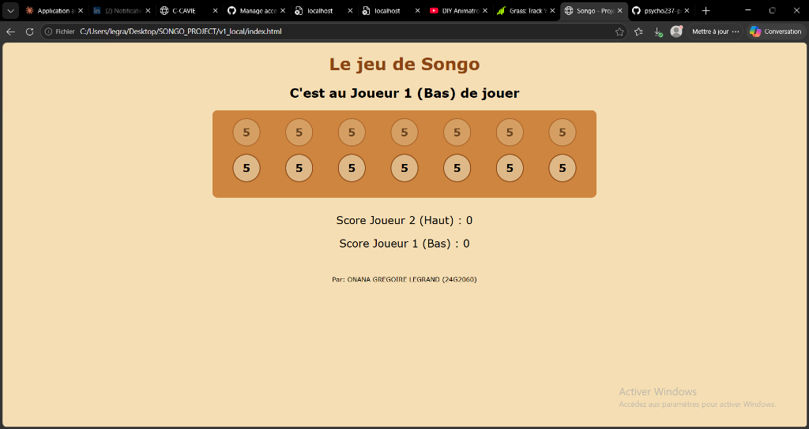

# RAPPORT DE PROJET : JEU DE SONGO
**Développé par :** kamdem wegang marianela

---

## 1. Fonctionnement du Jeu (Principe)

Le Songo est un jeu de semailles traditionnel africain (similaire à l'Awalé). Il oppose deux joueurs disposant chacun d'un camp de 7 trous. Au début de la partie, chaque trou contient 5 graines (total de 70 graines).
Le but est de capturer le maximum de graines. La partie s'achève lorsqu'il reste moins de 10 graines ou lorsqu'un joueur obtient 40 graines ou plus.

## 2. L'Algorithme de Base (Simplicité et Efficacité)
Pour respecter la contrainte de **reproduction du code en 35 minutes**, l'algorithme a été simplifié à l'extrême tout en gardant l'essence du Songo :
- **Le Plateau (Board) :** Représenté par un simple tableau (Array) de 14 cases. `0-6` pour le Joueur 1 (Bas) et `7-13` pour le Joueur 2 (Haut).
- **Le Parcours (Semaille) :** Le Songo se joue en boucle. Au lieu d'utiliser des conditions complexes, on utilise un tableau de "Mapping" appelé `nextHole`. 
  - `nextHole = [7, 0, 1, 2, 3, 4, 5, 8, 9, 10, 11, 12, 13, 6];`
  - Ce tableau indique immédiatement quelle est la case suivante pour n'importe quelle case donnée. L'algorithme se contente de faire une boucle `while` pour distribuer les graines.
- **La Prise (Capture) :** Une prise ne s'effectue que dans le camp adverse si la dernière graine tombe dans un trou qui contient entre 2 et 4 graines. Une prise en chaîne est calculée à l'aide d'un second tableau de mapping `prevHole` qui permet de remonter en arrière.
- **Règle Spécifique :** La case 1 de l'adversaire (qui correspond à sa gauche absolue, c'est-à-dire l'index 7 pour le Joueur 1 et l'index 0 pour le Joueur 2) est protégée contre les prises simples.

*Note de conception :* La règle de "plus de 13 graines = distribution exclusive chez l'adversaire" a été omise au profit d'un parcours en boucle standard pour maintenir le code ultra-court et recodable de tête facilement.

## 3. Organisation du Code

### Version 1 : Local (Sur le même PC)
- **Fichier unique `index.html`** : Contient la structure HTML, le style CSS (rudimentaire et esthétique), et la logique JavaScript.
- Tout est géré côté client : les variables `board` et `scores` maintiennent l'état, et la fonction `render()` met à jour le DOM après chaque appel à `play(hole)`.

### Version 2 : Distant (Deux PC séparés)
L'organisation adopte une architecture Client-Serveur "Ultra-Légère" (idéale pour un examen de 35 min) :
- **Frontend (`index.php`)** : Gère l'affichage et l'interaction utilisateur. Contrairement à la V1, la logique du jeu n'y est pas présente. Les clics déclenchent des appels **AJAX** via la fonction native `fetch()`. Le client interroge le serveur toutes les secondes (`setInterval` -> "Short Polling") pour rafraîchir l'interface.
- **Backend (`server.php`)** : Le contrôleur PHP qui contient tout l'algorithme du jeu (semaille, prise, changement de tour).
- **Base de Données (`state.json`)** : Au lieu d'une lourde base de données SQL (difficile à mettre en place rapidement), l'état global du jeu est sérialisé en JSON dans un fichier texte. C'est rapide, performant pour deux joueurs, et s'écrit en 2 lignes de PHP (`file_get_contents` / `file_put_contents`).

---
**Conclusion :** Le code est concis, l'algorithme mathématique est externalisé dans des tableaux de mapping (`nextHole` / `prevHole`), rendant l'ensemble robuste et mémorisable. Le design a été gardé volontairement minimaliste avec des couleurs "bois" (marron, beige, vert) pour évoquer l'aspect traditionnel sans alourdir le code CSS.
